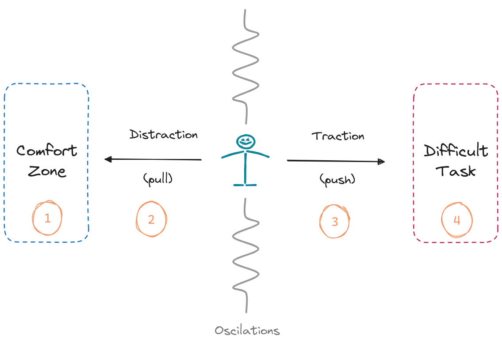

> *TDLR; Time management is pain management.*

Effective time management is akin to effectively managing pain. In our pursuit of productivity, we often seek the ultimate tool that promises to revolutionize our lives. Yet, what we fail to acknowledge is the responsibility and the inevitability of the considerable effort required from us.

_Dis-tractions_ are like attraction **forces** that pull us away from the tasks at hand. They tempt us with a false sense of comfort, luring us into a realm of ease and minimal cognitive effort. It is in this zone of tranquility that we find ourselves drifting further and further away from our goals.

On the contrary, _traction_ represents the invisible force that compels us to push forward, to commit ourselves wholeheartedly to the challenging tasks at hand. It demands our unwavering dedication and a willingness to confront the discomfort that accompanies venturing outside our comfort zones. Embracing traction comes with its share of pain.

While existing tools and approaches strive to shield us from the allure of comfort zones and aid in identifying and resisting the pull of distractions, they often neglect to address the inherent pain of the process. They provide us with strategies to bypass the discomfort, but they do little to help us embrace it as an integral part of our growth and development.

It is through the acknowledgment and acceptance of the pain that we opt to ignore it and truly unlock our potential, achieving the highest levels of productivity. By recognizing that discomfort is a necessary stepping stone on the path to success, we can develop the resilience and determination needed to overcome obstacles and accomplish our goals.

## Dealing with Forces

Distraction and traction are complementary forces, each of them aiming at different ends. The key to productivity lies in between these two forces. One cannot persist in attempting a demanding task indefinitely, but will achieve nothing by letting oneself be pulled away its attempt.

The optimum is in the middle. Only by oscillating between uncomfortable and resting environments, relaxing and hard-working states, can one optimize for effective productivity.

From a more practical point of view, a simplified classification of strategies to enhance productivity is anti-pull and pro-push strategies.

- **Anti-pull strategies** aim to avoid the pull effect of distractions through prevention (1) and detection (2).
- **Pro-push strategies** aspire to ease the action taking of a difficult task via pain inhibition (3) and intrinsic motivation (4).

